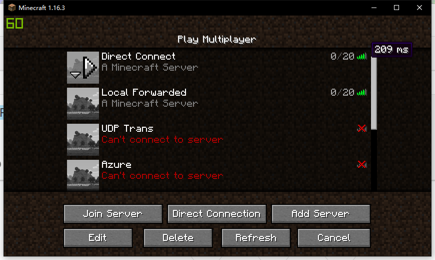
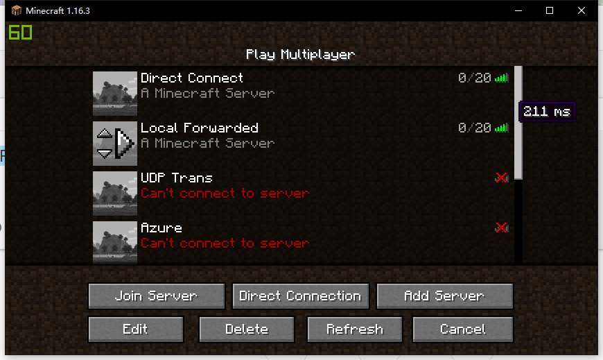
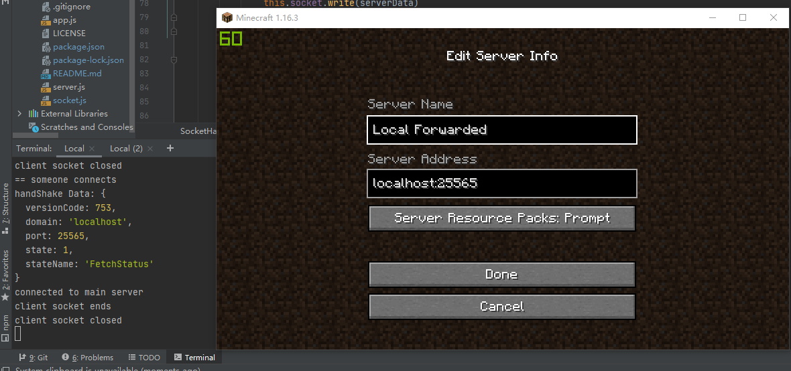

# node-minecraft-forwarder

## 0x00 What is this?

This is a Project for the [UBHacking 2020 Event](https://www.ubhacking.com/), 
welcome to check it out!

A Forwarder to re-route the traffic packets to MineCraft Server.

In the limited time, i wasn't able to finish the whole project,
but this is a PoC that proves how this project work.

## 0x01 How this work
The concept of this project is similar to a reverse proxy,
or CDN (not exactly, since CDN is trying to cache the static content
on the edge severs while this my project is trying to re-route the 
traffic through the edge server to the main game server).

The project can be deployed in hundreds of edge servers which are
close to the players around the world. These edge servers will
receive the games' data packets from the players, then re-route
these data packets back to the actual game server through the 
faster backbone network, and bring these benefits:

- Reduce Latency. Because of the complex network we have, the 
data packets might not be able to be delivered to the server in 
the most direct route. Instead, those data packets might be routed 
to different data centers before they were actually handed to our 
servers due to network congestion, ISP policies, and many other 
reasons. With this project, we can deploy hundreds of edge servers 
around the world, optimize the routing to make all the traffic between 
players and servers are through the fast backbone network.

- Prevent DDoS Attack (Not Implement Yet). The game servers are 
hidden behind the edge servers, so the players' and the attack 
traffic reaches the edge servers first. Then we can build a monitor 
system upon this project to set up alerts and respond quickly when 
the servers are facing a DDoS attack. And our game server that behinds 
the edge servers would remain safe all the time.

- High Scalability. This project is based on Node.JS, which means 
it could be easily deployed as a docker application, and use the 
infrastructures that have already been built by the ISPs, such as 
Microsoft Azure, AWS, Digital Ocean, and so on.

- Seamless. Since it's re-routing the data packets, the players do not
need to install any plugins or VPN software, so it's friendly to the
players. For example, with MineCraft Servers, the only thing they need 
to do is to change the servers' IP address.

## 0x02 What did this prove?

- First of all, this project now can re-route tcp packets from the 
edge, which can be work in the game using TCP, such as MineCraft. It
proves that technically feasible.

- Second, it shows the spending of processing the data packet by Node.JS 
is reasonable. In the test that the project runs locally, the process 
for the data only increases few milliseconds.





## 0x03 What else we can do with it?

- By parsing the MineCraft HandShake protocol, we can know the domain
that the client is requesting for. For example:


I am trying to join the server with the domain "localhost" and port 25565,
we can know both of them by parsing the HandShake protocol. So based on it,
we can re-route the traffic to the correct server (like the "host" setting
in the CDN).

## 0x04 How to deploy?

1. Set up the Node.JS environment
2. Clone this project by
    ```shell script
    git clone https://github.com/Y2Nk4/Fusion.git
    ```
3. Go to the project directory, then install the dependencies by the following command
    ```shell script
    npm install
    ```
4. Go to the `config` directory, copy the `config.js.example` and rename it as `config.js`, then revise the settings.
    - `mainServerHost` is the host(or IP address or Domain) of your server
    - `mainServerPort` is the port of your server
    
    - `localServerHost` is the host that you want this project to listen,
    leave it `0.0.0.0` if you want it to work in both LAN and WAN
    - `localServerPort` is the port that you want this project to listen
5. Use command `node app.js` to run it
6. To run it in daemon, using `pm2` to do so, for example, `pm2 start app.js`
